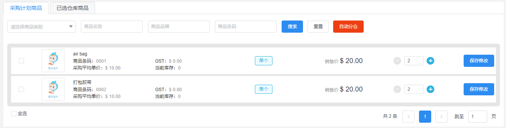
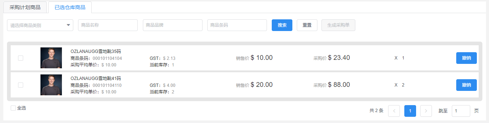
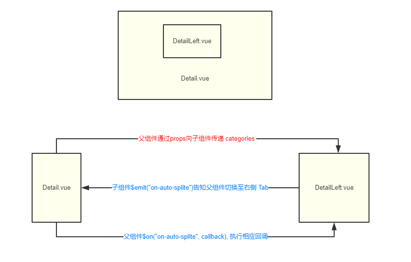
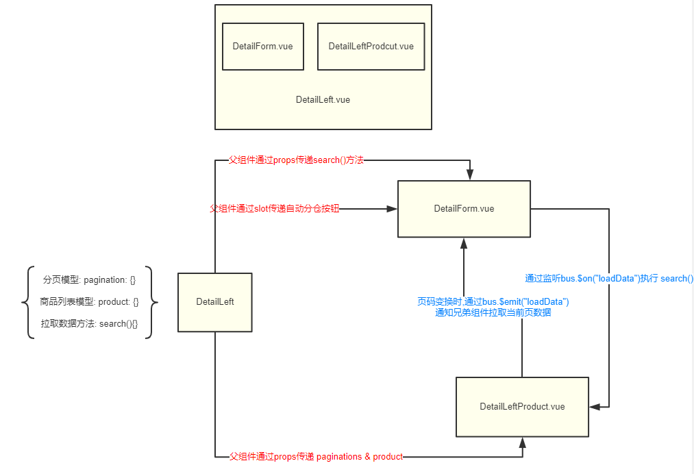

# 组件通讯

## 基础

组件之间的 **数据传递**、**事件传递** 即为 **组件通讯**

## 父子组件

### $refs

```js
this.$refs["ref_name"]
this.$refs["ref_name"].$options.name
this.$refs["ref_name"].data_attribute
this.$refs["ref_name"].function_name
```

### $children

```js
this.$children[0]
this.$children[0].$options
this.$children[0].data_attribute
this.$refs[0].function_name
```

### $parent

```js
this.$parent
this.$parent.$data
this.$parent.data_attribute
this.$parent.function_name
```

### prop

- camelCase vs kebab-case

```html
<!-- HTML 特性名称不区分大小写 -->
<!-- 最终 data-blogId 会转换成 data-blogid -->
<div data-blogId="1"></div>
<div data-blogid="1"></div>
```

```js
// 因此当你在子组件中声明一个 cameClass 的 prop 时
Vue.component("blog-post", {
    // 在 JS 中 prop 是 cameClass 的
    props: ["blogId"],
    template: "<div>{{ blogTitle }}</div>"
})
```

```html
<!-- 在 HTML 中是 kebab-case 的 -->
<blog-post blog-id="1"></blog-post>
```

- 传递静态、动态的 prop

```html
<!-- 静态的传递, 此时传递为 prop 数据类型为 String -->
<blog-post blog-id="1"></blog-post>
<!-- 动态的传递, 此时传递的 prop 数据类型与父组件中定义的数据类型一致 -->
<blog-post v-bind:blog-id="PARENT_COMPONENT_DATA_ATTRIBUTE"></blog-post>
```

### $attrs

```html
<!-- In Parent Component -->
<child-component data-abc="parent-attr-data"></child-component>
```

```js
// In Child Component
Vue.component("child-component", {
    template: "<div>{{ blogTitle }}</div>"
    // 不使用 prop 接收 data-abc
    mounted: function() {
        console.log(this.$attrs); // => {"data-abc": "parent-attr-data"}
    }
})
// 类似: 获取 DOM 对象后,获取特性名称对应的值
// $node.attr('data-abc');
```

### 双向绑定

- 父组件传递 prop 时, 添加 .sync 修饰符
```html
<!-- 详见 ChildTree.vue -->
<child-component :blog-id.sync="blog.id"></child-component>
```
- 子组件通过特殊的 update $emit 通知父组件更新相应的 prop
```js
Vue.component("child-component", {
    props: ["blogId"],
    data: function() {
        // 1. 声明一个 prop 副本
        id: this.blogId
    },
    watch: {
        // 2. 观察 prop, prop 变化时, 更新副本
        blogId(val){
            this.id = val
        },
        // 3. 观察 副本, 副本变化时, 通知父组件更新 prop
        id(val){
            this.$emit("update:blogId", val)
        }
    }
})
```


## 兄弟 & 祖孙组件通讯

- eventBus
```js
// 中央事件总线,就是一个空的 Vue 实例
const eventBus = new Vue();
```

```js
// child-two 组件通过 eventBus.$emit() 传递 "child-two-click" 事件
Vue.component("child-two", {
    template: "<div @click='click'>child-tow</div>",
    methods: {
        click: function(){
            eventBus.$emit("child-two-click", "child two say 'hi' to child one")
        }
    }
})

// 兄弟组件 child-one 通过 eventBus.$on() 监听 "child-two-click" 事件
Vue.component("child-one", {
    template: "<div>child-one</div>",
    mounted: function(){
        eventBus.$on("child-two-click", function(msg_from_child_one){
            console.log(msg_from_child_one); // => child two say 'hi' to child one
        })
    }
})
```

## 实战

- EOS 采购计划单详情





- 业务需求

1. 搜索按钮点击, 获取数据, 当前页重置为第一页

2. 当前页变化时, 获取当前页数据

3. 自动分仓按钮点击, 服务端处理成功后, Tabs 切换至右侧, 右侧需重新渲染数据

4. 生成采购单按钮点击, 服务端处理成功后, 跳转至采购单相应页面

5. 需要拉取商品分类数据, 渲染分类下拉框

- 拆分视图

1. Tabs 标签 => 公共组件

2. Form 搜索表单 => 公共组件 (左侧独有: **自动分仓**, 右侧独有: **生成采购单**)

3. Product 商品数据列表 => 独有组件 (包含分页组件)

4. Pagination 分页 => 公共组件(这里直接使用 iview Page 组件, 因此没有单独封装)

- 拆分组件

```shell
- views/                                    # 视图组件根目录

    - purchasePlan/                         # 采购计划单根目录

        - Detail.vue                        # 采购计划单详情视图组件 Tabs

        - detail-components/                # 详情视图组件 子组件根目录

            - DetailForm.vue                # 搜索表单 Form

            - DetailLeft.vue                # 左 Tabs 容器

            - DetailLeftProduct.vue         # 商品列表 Product

            - DetailRight.vue               # 右 Tabs 容器

            - DetailRightProduct.vue        # 商品列表 Product
```

- 设计层级

    1. 通过 ```<component></component>``` 完成 Tab 切换效果
    2. Form 可以复用, 通过 ```<slot></slot>``` 完成左右两边独有按钮业务逻辑

```html
<detail>
    <!--
        通过 <component :is="currentComponent"></component>
        动态挂载 <detail-left></detail-left> or <detail-right></detail-right>
    -->
    <detail-left>
        <detail-form>
            <template slot="extra-buttons">
                <button>自动分仓</button>
            </template>
        </detail-form> 
        <detail-left-product></detail-left-product>
    </detail-left>
    <detail-right>
        <detail-form>
            <template slot="extra-buttons">
                <button>生成采购单</button>
            </template>
        </detail-form> 
        <detail-right-product></detail-right-product>
    </detail-right>
</detail>
```

- 设计通讯

    1. 自动分仓 操作成功时, 因为自动分仓按钮是由 slot 分发的, 因此其仍然处于 ```DetailLeft.vue``` 作用域内,因此, 这一步的通讯, 其实是 ```Detail.vue``` 与 ```DetailLeft.vue``` 父子组件中的通讯, 我们直接使用 $emit 即可.

    2. 左右两侧 API 相同, 左侧需要额外参数 ```{status: 0}```, 右侧需要额外参数 ```{status: 1}```, 因此我们可以直接在 ```DetailLeft.vue``` ```DetailRight.vue``` 中硬编码这两个参数.

    3. 由于 ```DetailForm.vue``` 是复用的, 因此, 搜索按钮点击时, 需要根据其父组件的业务来请求对应的 API, 因此我们可以直接在 ```DetailLeft.vue``` 及 ```DetailRight.vue``` 中定义相关 ```loadData()``` 函数, 并将其通过 prop 传递给 ```DetailForm.vue```.

    4. ```loadData()``` 函数, 在获取数据时, 会有两种情况: 一种是查询当前页数据; 一种是进行某些操作,如"删除商品"等操作后,重置为第一页后再查询数据, 相当于做了一次初始化查询.

    5. 根据 4. ,我们可以定义两种数据拉取方式, 让 ```DetailLeftProduct.vue``` 通知 ```DetailForm.vue``` 当前是继续拉取当前页数据, 还是初始化, 从第一页开始重新获取数据.它们是一对平行组件, 因此我们可以使用 eventBus: ```eventBus.$emit("loadData")``` 继续加载; ```eventBus.$emit("reloadData")``` 重新初始化加载数据

- 图文说明



---



- Detail.vue

1. 使用 Vuejs 内置组件: ```<component></component>``` 的 ```is``` 进行容器组件的动态挂载 

2. 使用 Vuejs 内置组件: ```<keep-alive></keep-alive>``` 避免左右容器组件重复渲染

3. 这取决于实际业务场景, 这里只是介绍 keep-alive 使用

```html
<style lang="less">
  .tab-button {
    padding: 10px 20px;
    border-top-left-radius: 3px;
    border-top-right-radius: 3px;
    border: 1px solid #e9eaec;
    cursor: pointer;
    background: #fff;
    margin-bottom: -1px;
    margin-right: 5px;
    color: #999;
    &:hover,
    &.active {
      color: #2bb3e0;
    }
  }
</style>

<template>
  <div>
    <button 
        v-for="tab in tabs" 
        :key="tab.value" 
        :class="['tab-button', { active: currentTab === tab.value }]" 
        @click="currentTab = tab.value">
      {{ tab.label }}
    </button>

    <Card dis-hover>
      <component 
        :is="$currentTabComponent" 
        :categories="categories" 
        @on-auto-split="currentTab = 'right'">
      </component>
    </Card>
  </div>
</template>
```

```js
import DetailLeft from "./detail-components/DetailLeft.vue";
import DetailRight from "./detail-components/DetailRight.vue";
import { getAllProductCategroy } from "../../../api/store/home";
export default {
  components: {
    "detail-left": DetailLeft,
    "detail-right": DetailRight
  },

  data() {
    return {
      currentTab: "left",
      tabs: [
        {
          value: "left",
          label: "采购计划商品"
        },
        {
          value: "right",
          label: "已选仓库商品"
        }
      ],
      categories: []
    };
  },

  computed: {
    $currentTabComponent() {
      return `detail-${this.currentTab}`;
    }
  },

  created() {
    getAllProductCategroy().then(response => {
      this.categories = response.data;
    });
  }
};
```

- DetailLeft.vue

```html
<template>
  <div>
    <detail-form v-bind="{categories, status, search}">
      <template slot="extra-buttons">
        <Button 
            type="error" 
            @click="autoSplit" 
            :loading="btnAutoLoading" 
            :disabled="$checkList.length === 0">
            自动分仓
        </Button>
      </template>
    </detail-form>

    <detail-left-product v-bind="{product, pagination}"></detail-left-product>
  </div>
</template>
```

```js
import DetailForm from "./DetailForm.vue";
import DetailLeftProduct from "./DetailLeftProduct.vue";
import {
  getPlanOrderDetail,
  automaticDivision
} from "../../../../api/store/purchasePlan";
export default {
  inheritAttrs: false,

  components: {
    DetailForm,
    DetailLeftProduct
  },

  props: {
    categories: {
      type: Array,
      required: true,
      default: function() {
        return [];
      }
    }
  },

  data() {
    return {
      status: 0,
      btnAutoLoading: false,
      product: {
        data: [],
        loading: false,
        checkedAll: false
      },
      pagination: {
        current: 1,
        total: 0,
        pageSize: 10
      }
    };
  },

  computed: {
    $checkList() {
      let products = [];
      this.product.data.map(item => {
        if (item._checked) {
          products.push(item.planDetailId);
        }
      });
      return products;
    }
  },

  methods: {
    // 搜索
    search(options, reload = false) {
      if (reload) {
        this.pagination.current = 1;
      }
      this.product.loading = true;
      let num = this.pagination.current;
      let size = this.pagination.pageSize;
      let params = Object.assign({}, options, {
        num,
        size
      });
      getPlanOrderDetail(params)
        .then(response => {
          this.pagination.total = response.data.total;
          this.product.data = response.data.rows.map(item => {
            item.list.splice(0, 0, {
              type: 1,
              value: 1,
              remark: "单个"
            });
            let standard = item.list.length
              ? item.list[0]
              : {
                  value: 1
                };
            item._checked = false;
            item._standard = standard;
            item._proNum = item.planQutity;
            return item;
          });
          this.$nextTick(function() {
            this.product.loading = false;
          });
        })
        .catch(error => {
          this.product.loading = false;
        });
    },

    // 自动分仓
    autoSplit() {
      this.btnAutoLoading = true;
      automaticDivision({ detailId: this.$checkList })
        .then(response => {
          this.btnAutoLoading = false;
          if(response.success){
            this.$Message.success('自动分仓成功');
            this.$emit('on-auto-split');
          }
        })
        .catch(error => {
          this.btnAutoLoading = false;
          this.$Message.error(error.response.data.message);
        });
    }
  }
};
```

- DetailForm.vue

```html
<template>
  <div class="search-form-wrapper">
    <Form :model="form" ref="detailSearchForm" inline>
      <FormItem>
        <Cascader 
            v-model="selected_categories" 
            :data="categories" 
            filterable 
            placeholder="请选择商品分类">
        </Cascader>
      </FormItem>
      <FormItem prop="proName">
        <Input 
            type="text" 
            v-model.trim="form.proName" 
            clearable 
            placeholder="商品名称" 
            @on-enter="submit">
        </Input>
      </FormItem>
      <FormItem prop="proBrandName">
        <Input 
            type="text" 
            v-model.trim="form.proBrandName" 
            clearable 
            placeholder="商品品牌" 
            @on-enter="submit">
        </Input>
      </FormItem>
      <FormItem prop="proBarcode">
        <Input 
            type="text" 
            v-model.trim="form.proBarcode" 
            clearable placeholder="商品条码" 
            @on-enter="submit">
        </Input>
      </FormItem>
      <FormItem>
        <Button type="primary" @click="submit">搜索</Button>
        <Button type="ghost" @click="reset" style="margin: 0 8px;">重置</Button>
        <slot name="extra-buttons"></slot>
      </FormItem>
    </Form>
  </div>
</template>
```

```js
import bus from "../../../../utils/bus";
export default {
  props: {
    status: {
      type: Number,
      default: 0,
      required: true
    },
    categories: {
      type: Array,
      required: true,
      default: function() {
        return [];
      }
    },
    search: {
      type: Function,
      required: true
    }
  },

  data() {
    return {
      form: {
        planStatu: this.status,
        planNo: this.$route.query.planNo,
        proBrandName: "",
        proName: "",
        proBarcode: ""
      },
      selected_categories: []
    };
  },

  computed: {
    proCategoryCode() {
      return this.selected_categories[1] ? this.selected_categories[1] : "";
    }
  },

  created() {
    bus.$on("reloadData", msg => {
      this.submit(true);
    });
    bus.$on("loadData", msg => {
      this.submit(false);
    });
  },

  mounted() {
    this.submit();
  },

  methods: {
    submit(reload = false) {
      let params = Object.assign({}, this.form, {
        proCategoryCode: this.proCategoryCode
      });
      this.search(params, reload);
    },

    reset() {
      this.selected_categories = [];
      this.$refs["detailSearchForm"].resetFields();
    }
  }
};
```

- DetailLeftProduct.vue

```js
import defaultImg from "../../../../assets/product.jpg";
import {
  modifyPlanOrderDetail,
  deletePlanOrderDetail
} from "../../../../api/store/purchasePlan";
import { mapGetters } from "vuex";
import bus from "../../../../utils/bus";
export default {
  props: {
    product: {
      type: Object,
      required: true,
      default: function() {
        return {};
      }
    },
    pagination: {
      type: Object,
      required: true,
      default: function() {
        return {};
      }
    }
  },

  computed: {
    ...mapGetters(["fileserver"]),
    $checkList() {
      let products = [];
      this.product.data.map(item => {
        if (item._checked) {
          products.push(item.planDetailId);
        }
      });
      return products;
    }
  },

  data() {
    return {
      defaultImg,
      btnRemoveLoading: false
    };
  },

  methods: {
    // 单选
    checkItem() {
      let found = this.product.data.find(item => {
        return item._checked === false;
      });
      if (found === undefined) {
        this.product.checkedAll = true;
      } else {
        this.product.checkedAll = false;
      }
    },

    // 全选
    checkAll() {
      this.product.checkedAll = !this.product.checkedAll;
      if (this.product.checkedAll) {
        this.product.data.map(item => {
          item._checked = true;
        });
      } else {
        this.product.data.map(item => {
          item._checked = false;
        });
      }
    },

    // 规格选择
    attrChange(item, index, attr) {
      this.product.data[index]["_standard"] = attr;
    },

    // - 按钮点击
    reduce(item, index) {
      let standard = item._standard;
      let step = standard.value;
      let number = this.product.data[index]["_proNum"];
      if (number <= 0) {
        return;
      }
      if (number <= step) {
        this.product.data[index]["_proNum"] = 0;
        return;
      }

      this.product.data[index]["_proNum"] -= step;
    },

    // + 按钮点击
    plus(item, index) {
      let standard = item._standard;
      let step = standard.value;
      this.product.data[index]["_proNum"] += step;
    },

    // 保存按钮点击
    save(item) {
      let params = {
        planNum: this.$route.query.planNo,
        proName: item.proName,
        proQutity: item._proNum,
        proSKU: item.proBarcode
      };
      modifyPlanOrderDetail(params)
        .then(response => {
          if (response.success) {
            this.$Message.success("保存成功");
          } else {
            this.$Message.error("保存失败");
          }
        })
        .catch(error => {
          this.$Message.error(error.response.data.message);
        });
    },

    // 删除商品
    remove() {
      this.btnRemoveLoading = true;
      let data = {
        planNo: this.$route.query.planNo,
        idList: this.$checkList
      };
      deletePlanOrderDetail(data)
        .then(response => {
          this.btnRemoveLoading = false;
          if (response.success) {
            this.$Message.success("移除成功");
            // 删除成功后, 重新加载数据
            bus.$emit("reloadData");
          }
        })
        .catch(error => {
          this.btnRemoveLoading = false;
          this.$Message.warning(error.response.data.message);
        });
    },

    // 分页
    pageChange(){
      // 页码变化时, 加载当前页数据
      bus.$emit("loadData");
    }
  }
};
```

```html
<template>
  <div>

    <div class="product-line-wrapper" :class="[product.loading ? 'loading' : '']">
      <Spin size="large" fix v-show="product.loading"></Spin>
      <div class="empty-wrapper" v-show="!product.loading & product.data.length === 0">暂无数据</div>
      <div class="product-item" v-for="(item, index) in product.data">
        <Row type="flex" align="middle">
          <Col span="1">
          <div class="checkbox">
            <Checkbox v-model="item._checked" @on-change="checkItem"></Checkbox>
          </div>
          </Col>
          <Col span="2">
          
          </Col>
          <Col span="7">
          <div class="info">
            <p class="name">{{ item.proName }}</p>
            <Row>
              <Col span="14">
              <p>商品条码：
                <span>{{ item.proBarcode }}</span>
              </p>
              <p>采购平均单价：
                <span>{{ item.averagePrice | numberFormat }}</span>
              </p>
              </Col>
              <Col span="10">
              <p>GST：
                <span>{{ item.proGST | numberFormat }}</span>
              </p>
              <p>当前库存：
                <span>{{ item.proQutity || 0}}</span>
              </p>
              </Col>
            </Row>
          </div>
          </Col>
          <Col span="5">
          <div class="standard">
            <span class="standard-btn" v-for="attr in item.list" :class="{ active: item._standard == attr }" @click="attrChange(item, index, attr)">
              {{attr.remark}}
              <template v-if="attr.remark !== '单个'">{{attr.value}}</template>
            </span>
          </div>
          </Col>
          <Col span="3">
          <div class="price">
            销售价
            <span>{{ item.salePrice | numberFormat }}</span>
          </div>
          </Col>
          <Col span="4">
          <div class="number">
            <span class="reduce-btn" @click="reduce(item, index)">
              <Icon type="android-remove"></Icon>
            </span>
            <div class="number-input">
              <InputNumber :min="1" :style="{maxWidth: '100%'}" v-model.number="item._proNum" size="small"></InputNumber>
            </div>
            <span class="plus-btn active" @click="plus(item, index)">
              <Icon type="plus"></Icon>
            </span>
          </div>
          </Col>
          <Col span="2" style="text-align:right">
          <Button type="primary" @click="save(item)">保存修改</Button>
          </Col>
        </Row>
      </div>
    </div>
    <Row type="flex" class="pagination-wrapper">
      <Col span="4" class="page-size-wrapper">
      <Row type="flex" align="middle" v-show="product.data.length">
        <Col span="24">
        <Checkbox v-model="product.checkedAll" @click.prevent.native="checkAll">全选</Checkbox>
        <Button type="ghost" @click="remove" :loading="btnRemoveLoading" :disabled="$checkList.length === 0">删除商品</Button>
        </Col>
      </Row>
      </Col>
      <Col span="20" class="page-wrapper">
      <Page :current.sync="pagination.current" :total="pagination.total" :page-size="pagination.pageSize" @on-change="pageChange" show-total show-elevator>
      </Page>
      </Col>
    </Row>
  </div>
</template>
```